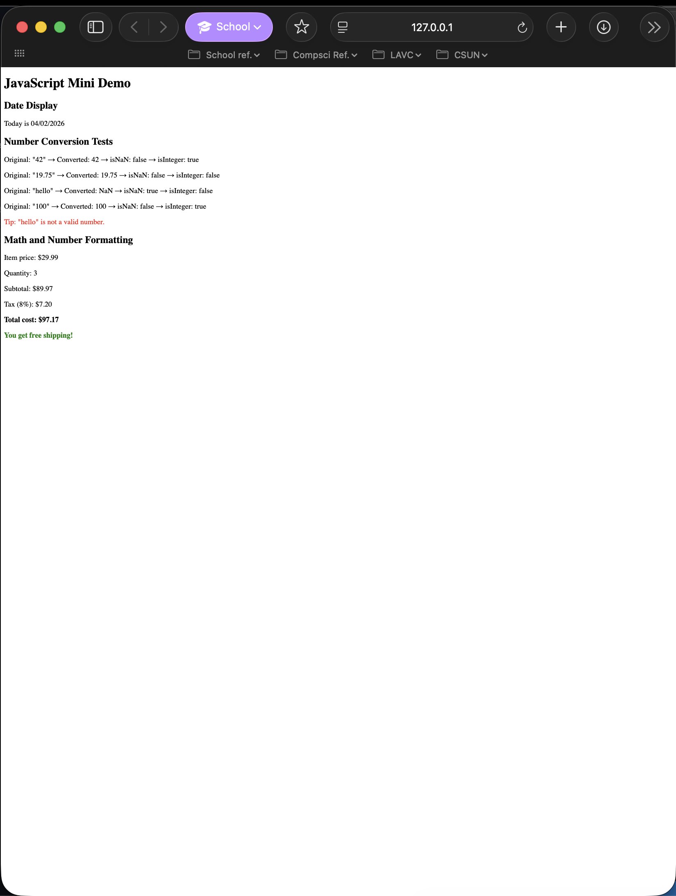

# HW #9 JavaScript Mini Demo:

**Website Link:** [https://femsigh.github.io/hw9/](https://femsigh.github.io/hw9/)

## Built-in Objects & Methods

- **Date object:** 'new Date()', 'getMonth()', 'getDate()', 'getFullYear()'

- **String Method:** 'padStart()'

- **Number objects:** 'Number()', 'Number.isNaN()', 'Number.isInteger()'

- **Number Formatting:** 'toFixed(2)'

- **DOM METHOD:** 'getElementById()', 'createElement()', 'appendChild()'

## Reflections

- **Hardest:** Understanding why `NaN === NaN` is false and why `Number.isNaN()` is necessary.
- **Medium:** It was fun, but learning the hierarchy rules of the markdown system lol
- **Easiest:** Formatting the date with `padStart()` was simple once I remembered to convert numbers to strings.
- **What's new for me:** Months are 0-indexed, so you must add 1 to get the real month number.
- **Number object:** `Number.isInteger()` correctly returns `false` for decimals like `19.75`. Also, non‑numeric strings become `NaN`.
- **Displaying results in the browser:** Using `innerHTML` and `createElement` + `appendChild` lets me add dynamic content anywhere on the page.

## Reference

MDN Web Docs for reference.

### Documentation Links

### Part 1: Date Display

- [`new Date()`](https://developer.mozilla.org/en-US/docs/Web/JavaScript/Reference/Global_Objects/Date/Date)
- [`getMonth()`](https://developer.mozilla.org/en-US/docs/Web/JavaScript/Reference/Global_Objects/Date/getMonth)
- [`getDate()`](https://developer.mozilla.org/en-US/docs/Web/JavaScript/Reference/Global_Objects/Date/getDate)
- [`getFullYear()`](https://developer.mozilla.org/en-US/docs/Web/JavaScript/Reference/Global_Objects/Date/getFullYear)
- [`toString()`](https://developer.mozilla.org/en-US/docs/Web/JavaScript/Reference/Global_Objects/Object/toString)
- [`padStart()`](https://developer.mozilla.org/en-US/docs/Web/JavaScript/Reference/Global_Objects/String/padStart)
- [`getElementById()`](https://developer.mozilla.org/en-US/docs/Web/API/Document/getElementById)
- [`textContent`](https://developer.mozilla.org/en-US/docs/Web/API/Node/textContent)

### Part 2: Number Conversion & Validation

- [`Number()`](https://developer.mozilla.org/en-US/docs/Web/JavaScript/Reference/Global_Objects/Number/Number)
- [`Number.isNaN()`](https://developer.mozilla.org/en-US/docs/Web/JavaScript/Reference/Global_Objects/Number/isNaN)
- [`Number.isInteger()`](https://developer.mozilla.org/en-US/docs/Web/JavaScript/Reference/Global_Objects/Number/isInteger)
- [`innerHTML`](https://developer.mozilla.org/en-US/docs/Web/API/Element/innerHTML)
- [`createElement()`](https://developer.mozilla.org/en-US/docs/Web/API/Document/createElement)
- [`appendChild()`](https://developer.mozilla.org/en-US/docs/Web/API/Node/appendChild)
- [`style` property](https://developer.mozilla.org/en-US/docs/Web/API/HTMLElement/style)

### Part 3: Math & Formatting

- [Multiplication (`*`)](https://developer.mozilla.org/en-US/docs/Web/JavaScript/Reference/Operators/Multiplication)
- [Addition (`+`)](https://developer.mozilla.org/en-US/docs/Web/JavaScript/Reference/Operators/Addition)
- [`toFixed()`](https://developer.mozilla.org/en-US/docs/Web/JavaScript/Reference/Global_Objects/Number/toFixed)

### Part 4: Conditionals

- [`if...else`](https://developer.mozilla.org/en-US/docs/Web/JavaScript/Reference/Statements/if...else)
- [Greater than (`>`)](https://developer.mozilla.org/en-US/docs/Web/JavaScript/Reference/Operators/Greater_than)
- [Subtraction (`-`)](https://developer.mozilla.org/en-US/docs/Web/JavaScript/Reference/Operators/Subtraction)
- [Template literals](https://developer.mozilla.org/en-US/docs/Web/JavaScript/Reference/Template_literals)

### General

- [`const`](https://developer.mozilla.org/en-US/docs/Web/JavaScript/Reference/Statements/const)
- [`let`](https://developer.mozilla.org/en-US/docs/Web/JavaScript/Reference/Statements/let)
- [`function`](https://developer.mozilla.org/en-US/docs/Web/JavaScript/Reference/Statements/function)

## Screenshot

